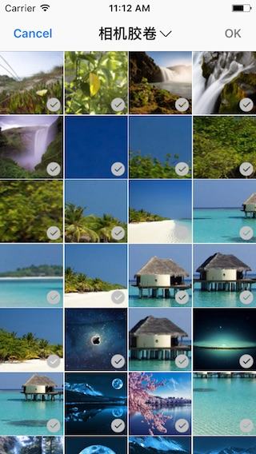
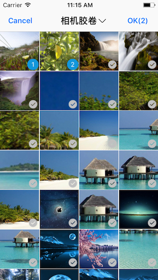
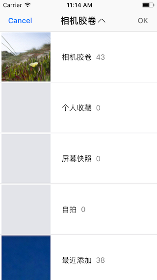

# SWImagePickerController

A controller to pick saved images.

## Major features

### Unselected status



### Allow single selection and selected status


### Allow multiple selections and selected status (not max selected count)



### Allow multiple selections and max selected count status


### Choose albums



## How to use

### Initialize
```
// In a controller
let picker = SWImagePickerController()
picker.delegate = self // conforms to SWImagePickerControllerDelegate
```

### Allow to select only one image
```
picker.allowsMultipleSelection = false // or picker.maxSelectionCount = 1
```

### Allow to select n (the number you want) images
```
picker.maxSelectionCount = yourNumber // default is 5
```

### To push by navigation controller
```
navigationController?.pushViewController(picker, animated: true)
```

### To present by current controller
```
let nc = UINavigationController(rootViewController: picker)
present(nc, animated: true, completion: nil)
```

### Implement SWImagePickerControllerDelegate
```
func imagePickerController(_ picker: SWImagePickerController, didFinishPickingImageWithInfos infos: [[String : AnyObject]]) {
        
	for dict in infos {
		let image = dict[SWImagePickerControllerImage] as! UIImage
		let assetLocalID = dict[SWImagePickerControllerAssetLocalIdentifier] as! String
		// Do someting with image or asset local id
	}
}

// Optional
func imagePickerControllerDidCancel(_ picker: SWImagePickerController) {}
```